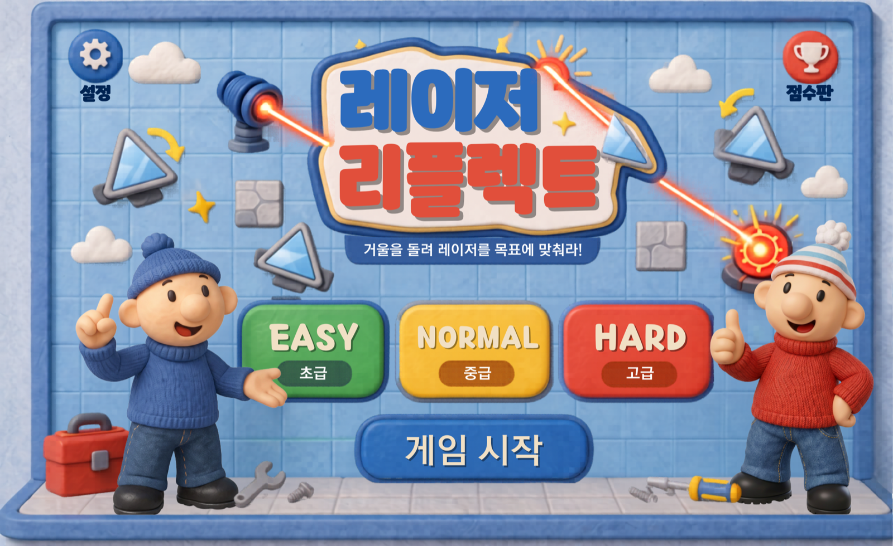

# 레이저 리플렉트 (Laser Reflect)

> **거울을 돌려 레이저를 목표로 맞추자!** — 전자칠판용 2D 빛 반사 퍼즐 게임

---

## 🖼 스크린샷



---

## 📖 소개

**레이저 리플렉트**는 전자칠판(電子칠판)에서 두 팀이 대결하는 2D 레이저 반사 퍼즐 게임입니다. 격자(grid) 위에 놓인 거울을 회전시켜 발사 장치에서 나온 레이저를 장애물 너머 목표 지점까지 정확히 굴절시키는 것이 목표입니다. 단순 조작이 아니라 **"어느 거울을 어떤 순서로 돌려야 하는가"** 를 추론하는 과정에서 공간지각·경로 추론·문제 해결 능력을 기르도록 설계된 교육용 게임입니다.

빌드 도구 없이 브라우저에서 바로 도는 단일 `<canvas>` 단일 페이지 앱이며, 호스팅 플랫폼의 iframe 안에 임베드되어 `postMessage`로 부모창과 통신합니다. 모든 UI/게임 텍스트는 한국어입니다.

---

## ✨ 주요 기능

- **격자 기반 레이저 광선 추적 엔진** — 레이저가 셀 단위로 진행하며 거울에서 반사/통과를 판정하고, 완벽 성공 / 부분 성공 / 실패 사유를 반환합니다.
- **거울 4종 회전 퍼즐** — `/` `\`(대각선)과 `|` `-`(가로/세로) 거울. EASY·NORMAL은 90도 회전, HARD는 45도 단위 회전을 지원합니다.
- **절차적 스테이지 생성** — 정답 경로를 먼저 만든 뒤 거울 방향을 흐트러뜨려 **항상 풀 수 있는 보드**를 보장합니다(난이도별 파라미터로 거울 수·장애물·이동 장애물 조절).
- **2팀 대항 + 누적 점수제** — 3개 라운드 × 2 스테이지(총 6스테이지)를 두 팀이 번갈아 진행, 누적 점수로 최종 승부를 가립니다.
- **점수 & 콤보 시스템** — 완벽 성공 10점 / 부분 성공 5점 / 실패 0점에 더해, 레이저가 거울을 연속 통과할 때마다 **콤보 보너스**가 누적됩니다.
- **5단계 phase 상태 머신** — `intro → predict(예측) → manipulate(조작) → fire(발사) → result(결과)` 흐름으로 라운드가 진행됩니다.
- **연출 효과** — 발사 장치 점등 / 목표 점멸 / 조작 가능 거울 강조 / 회전 아이콘 / 카운트다운, 그리고 거울 반사 시점마다 `COMBO x2/x3…` 텍스트 팝업과 링·파티클 폭발, 콤보 단계별 색상 변화(노랑→주황→붉은 금색).
- **반응형 레터박스 스케일링** — 논리 해상도 1280×800 고정. `ResizeObserver`로 뷰포트에 맞춰 캔버스를 자동 스케일링합니다.
- **터치/마우스 통합 입력** — `pointer` 이벤트로 전자칠판 터치와 마우스를 동시에 지원합니다.
- **타이틀 화면 레이아웃 에디터(개발용)** — 타이틀 아트를 드래그/리사이즈/회전하고 `layout.json`으로 내보내는 인-게임 에디터를 내장합니다.
- **플랫폼 임베드 연동** — 부모창의 `ping` / `request-canvas-capture`(썸네일) / `request-app-resolution` 요청에 응답하는 iframe 프로토콜을 구현합니다.

---

## 🛠 기술 스택

- **언어**: TypeScript (소스) → esbuild ESM 번들(`main.js`)
- **렌더링**: HTML5 Canvas 2D (게임 렌더링은 순수 캔버스 직접 드로잉)
- **빌드**: esbuild (`npx`로 실행, in-repo `package.json`/`node_modules` 없음)
- **외부 라이브러리 (CDN importmap)**: `three`, `cannon-es`, `howler`, `tone`, `gsap`, `mathjs`, `canvas-confetti`, `html-to-image`
  - 실제 번들에 import되는 것은 `canvas-confetti`(결과 화면)와 `html-to-image`(캡처) 2개입니다.
- **폰트**: Pretendard(로컬 woff2) + Gmarket Sans(CDN)
- **런타임 데이터**: `data.json` (라운드/팀/점수/난이도 파라미터 및 UI 텍스트를 코드와 분리)

> `tsconfig.json`은 의도적으로 느슨하게 설정(`strict: false`, `strictNullChecks: false`)되어 있으나 `noImplicitAny: true`를 유지합니다.

---

## 🚀 실행 방법

> ⚠️ **`index.html`을 더블클릭(`file://`)으로 열면 동작하지 않습니다.** 게임이 `data.json`을 `fetch`로 불러오므로 반드시 **로컬 정적 서버**로 열어야 합니다. 또한 외부 라이브러리와 일부 폰트를 CDN에서 받으므로 **인터넷 연결**이 필요합니다.

저장소를 클론한 뒤 **`app/`** 폴더를 정적 서버로 띄우면 됩니다.

### 방법 A — 터미널 (Python 또는 Node)

```bash
git clone https://github.com/suckhee0227/laser-reflect.git
cd laser-reflect/app

# Python 3가 있으면
python3 -m http.server 8080
#  → 브라우저에서 http://localhost:8080 접속

# 또는 Node가 있으면 (별도 설치 불필요, npx가 받아줌)
npx serve .
#  → 출력되는 주소(예: http://localhost:3000) 접속
```

### 방법 B — VS Code Live Server (가장 쉬움)

1. **VS Code** 설치 → 확장(Extensions)에서 **`Live Server`**(작성자: Ritwick Dey) 설치
2. VS Code에서 이 프로젝트 폴더를 엽니다 (`File ▸ Open Folder…`)
3. 탐색기에서 **`app/index.html`** 우클릭 → **`Open with Live Server`**
4. 브라우저가 자동으로 열리고 게임이 실행됩니다 (예: `http://127.0.0.1:5500/app/index.html`)

### 소스 수정 후 재빌드 (개발자용)

`main.js`는 **손으로 고치지 않습니다.** TypeScript 소스(`main.ts`/`app.ts`/`appHelper.ts`)를 고친 뒤 esbuild로 다시 번들합니다. CDN 라이브러리는 importmap에서 런타임에 해석되므로 **external**로 둡니다.

```bash
npx esbuild app/main.ts --bundle --format=esm --outfile=app/main.js --packages=external
```

> 새 라이브러리를 `import` 하려면 `index.html`의 `<script type="importmap">`에도 반드시 추가해야 브라우저에서 동작합니다.

---

## 📂 프로젝트 구조

배포·실행에 필요한 실제 앱은 전부 **`app/`** 안에 있습니다.

```
laser-reflect/
├── app/                    ← 실제 게임 (이 폴더만 있으면 실행됨)
│   ├── index.html          ← 진입점 (Live Server로 이 파일을 엶)
│   ├── main.js             ← esbuild 빌드 산출물(자동 생성, 직접 수정 금지)
│   ├── data.json           ← 런타임 설정(라운드/팀/점수/난이도/UI 텍스트)
│   ├── style.css
│   ├── assets/             ← 스프라이트·폰트·오디오·썸네일
│   │   ├── fonts/
│   │   └── title/          ← 타이틀 화면 아트 + layout.json
│   ├── archive/            ← 버전 스냅샷(v1/v2) + change_log.json (참고용)
│   │
│   ├── main.ts             ← (소스) 부트스트랩 + 플랫폼/호스트 연동
│   ├── app.ts              ← (소스) 게임 로직 전체 (~3300줄)
│   ├── appHelper.ts        ← (소스) 데이터 로딩·좌표 변환 유틸리티
│   └── tsconfig.json
│
├── 기획안.md               ← 게임 기획 원본 (Single Source of Truth)
├── images/                 ← 디자인 원본 아트셋
├── ingame_assets/          ← 인게임 에셋 원본
└── README.md
```

### 코드 아키텍처 (소스 4파일, 계층 구조)

- **`index.html`** — 호스트 셸. importmap, 에러 수집 하니스, `preserveDrawingBuffer` 패치, DOM(`#appCanvas` + `#uiLayer`)을 포함합니다.
- **`main.ts`** — 부트스트랩과 플랫폼 연동(반응형 스케일링, 부모↔iframe `postMessage` 프로토콜). 게임 로직은 없습니다.
- **`appHelper.ts`** — `data.json` 로딩, 논리 좌표 변환(`getRelativeCoordinates`), 텍스트 살균(XSS 가드), 캔버스 캡처 유틸.
- **`app.ts`** — 레이저 추적 엔진, 절차적 스테이지 생성, 화면 렌더러, 입력 처리, 메인 루프까지 게임 전체.

---

## 🎮 게임 흐름 요약

| 단계 | 이름 | 핵심 활동 |
|------|------|-----------|
| STEP 1 | 맵 확인 및 예측 | 거울·장애물·목표 배치 확인 + 팀별 경로 예측 |
| STEP 2 | 협의 및 조작 | 제한 시간 내 거울 회전(90°/HARD 45°) |
| STEP 3 | 완료 확인 | 완료 버튼 또는 시간 초과 시 자동 진행 |
| STEP 4 | 발사 및 채점 | 레이저 발사 → 성공/실패 판정 → 점수·콤보 부여 |
| STEP 5 | 다음 라운드 | 난이도 상승 후 진행, 점수 누적 (총 3R) |

3개 라운드(6스테이지) 완료 후 누적 점수가 높은 팀이 승리합니다.
